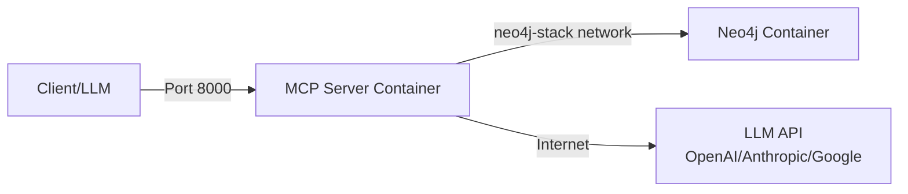

# Docker Deployment Guide

Complete guide to deploying Neo4j YASS MCP Server with Docker.

---

## 📋 Table of Contents

- [Quick Start](#quick-start)
- [Dockerfile Explained](#dockerfile-explained)
- [Docker Compose](#docker-compose)
- [Configuration](#configuration)
- [Networking](#networking)
- [Storage & Volumes](#storage--volumes)
- [Security](#security)
- [Multi-Instance Deployment](#multi-instance-deployment)
- [Troubleshooting](#troubleshooting)

---

## 🚀 Quick Start

### Prerequisites

- Docker 20.10+ with BuildKit enabled
- Docker Compose V2 (command: docker compose)
- Neo4j 5.x running (separate instance)
- GNU Make (optional, for convenience commands)

### 1. Clone and Configure

```bash
git clone https://github.com/hdjebar/neo4j-yass-mcp.git
cd neo4j-yass-mcp

# Copy environment template
cp .env.example .env

# Edit .env with your settings
nano .env
```

### 2. Create Network (First Time Only)

```bash
# Create neo4j-stack network for inter-container communication
make docker-network

# Or manually:
docker network create neo4j-stack
```

**Note:** If your Neo4j container is already running in a different network, you can connect it:
```bash
docker network connect neo4j-stack <neo4j-container-name>
```

### 3. Start the Server

```bash
# With Makefile (recommended - auto-creates network)
make docker-up

# Or with Docker Compose directly
docker compose up -d

# View logs
make docker-logs
# Or: docker compose logs -f

# Check status
docker compose ps
```

### 4. Verify

```bash
# Check health
curl http://localhost:8000/health

# Test Neo4j connection
make docker-test-neo4j

# View logs for "initialized successfully"
docker compose logs | grep "initialized successfully"

# Check network connectivity
docker network inspect neo4j-stack --format='{{range .Containers}}{{.Name}} {{end}}'
```

---

## 📦 Dockerfile Explained

### Multi-Stage Build with uv

The [Dockerfile](Dockerfile) uses a **multi-stage build** with **uv** for ultra-fast package installation:

```dockerfile
# Stage 1: Builder - Install dependencies with uv
FROM python:3.11-slim as builder
# Install uv (10-100x faster than pip)
RUN curl -LsSf https://astral.sh/uv/install.sh | sh
# Install dependencies in virtual environment
RUN --mount=type=cache,target=/root/.cache/uv \
    uv pip install .

# Stage 2: Runtime - Minimal image
FROM python:3.11-slim
# Copy only virtual environment and code
```

**Benefits:**
- ✅ **10-100x faster** dependency installation with `uv`
- ✅ BuildKit cache mount for near-instant rebuilds
- ✅ Smaller final image (~150MB vs ~500MB)
- ✅ Parallel package downloads
- ✅ No build tools in production image
- ✅ Better security (minimal attack surface)

### Security Features

```dockerfile
# Non-root user
RUN groupadd -r mcp && useradd -r -g mcp mcp
USER mcp

# Minimal dependencies
RUN apt-get install ca-certificates # Only essentials

# No cache files
RUN pip install --no-cache-dir ...
```

### Build Arguments

You can customize the build:

```bash
# Build with BuildKit (required for cache mount)
DOCKER_BUILDKIT=1 docker build -t neo4j-yass-mcp:latest .

# Build with different Python version
docker build --build-arg PYTHON_VERSION=3.12 --build-arg APP_VERSION=1.0.0 -t neo4j-yass-mcp .

# Build for specific platform
docker build --platform linux/amd64 -t neo4j-yass-mcp .

# Disable cache (force clean build)
docker build --no-cache -t neo4j-yass-mcp .
```

**Note:** Docker BuildKit is enabled by default in Docker 23.0+. For older versions, set `DOCKER_BUILDKIT=1` or add to `/etc/docker/daemon.json`:
```json
{
  "features": {
    "buildkit": true
  }
}
```

---

## 🐳 Docker Compose

### Basic Usage

```bash
# Start
docker compose up -d

# Stop
docker compose stop

# Restart
docker compose restart

# Stop and remove
docker compose down

# View logs
docker compose logs -f

# Execute command in container
docker compose exec neo4j-yass-mcp bash
```

### Environment Variables

Configure via `.env` file:

```bash
# Minimum configuration
NEO4J_URI=bolt://neo4j:7687
NEO4J_PASSWORD=your-strong-password
LLM_PROVIDER=openai
LLM_API_KEY=sk-your-api-key
```

All variables from [.env.example](.env.example) are supported.

---

## ⚙️ Configuration

### Transport Modes

#### HTTP (Recommended for Docker)

```bash
# In .env
MCP_TRANSPORT=http
MCP_SERVER_HOST=0.0.0.0  # Listen on all interfaces
MCP_SERVER_PORT=8000
MCP_SERVER_PATH=/mcp/
```

Access: `http://localhost:8000/mcp/`

#### SSE (Legacy)

```bash
# In .env
MCP_TRANSPORT=sse
MCP_SERVER_HOST=0.0.0.0
MCP_SERVER_PORT=8000
```

#### Stdio (Not for Docker)

Stdio mode is for local/CLI use, not Docker networking.

---

## 🌐 Networking

### Network Architecture

The MCP server uses a dedicated `neo4j-stack` network to communicate with Neo4j:



### Option 1: External Neo4j Network (Recommended)

**Best for:** Multi-service setups where Neo4j and MCP server are in separate docker-compose files.

```yaml
# docker-compose.yml (already configured)
networks:
  neo4j-stack:
    external: true  # Connects to existing network
```

```bash
# .env
NEO4J_URI=bolt://neo4j:7687  # Use Neo4j container name
```

**Setup:**
```bash
# 1. Create network (automatic with Makefile)
make docker-network
# Or manually: docker network create neo4j-stack

# 2. Start Neo4j in that network
cd /path/to/neo4j
docker compose up -d

# 3. Start MCP server (auto-creates network if needed)
cd /path/to/neo4j-yass-mcp
make docker-up
# Or: docker compose up -d
```

**Verify network connection:**
```bash
# List containers in neo4j-stack network
docker network inspect neo4j-stack --format='{{range .Containers}}{{.Name}} {{end}}'

# Should show both neo4j and neo4j-yass-mcp containers
```

### Option 2: Host Network

If Neo4j is on host machine (localhost):

```yaml
# docker-compose.yml - uncomment this
network_mode: "host"
```

```bash
# .env
NEO4J_URI=bolt://localhost:7687
```

**Note:** Disables Docker networking, uses host's network directly.

### Option 3: host.docker.internal

If Neo4j is on host, but you want Docker networking:

```bash
# .env
NEO4J_URI=bolt://host.docker.internal:7687
```

Works on Docker Desktop (Mac/Windows). On Linux, add:

```yaml
# docker-compose.yml
extra_hosts:
  - "host.docker.internal:host-gateway"
```

### Option 4: Cloud Neo4j (AuraDB)

```bash
# .env
NEO4J_URI=neo4j+s://xxxxx.databases.neo4j.io
NEO4J_USERNAME=neo4j
NEO4J_PASSWORD=your-aura-password
```

No network configuration needed (uses internet).

---

## 💾 Storage & Volumes

### Volumes in docker-compose.yml

```yaml
volumes:
  # Audit logs (persistent)
  - ./data/logs:/app/logs

  # Environment file (read-only)
  - ./.env:/app/.env:ro
```

### Directory Structure

```
neo4j-yass-mcp/
├── data/
│   └── logs/
│       └── audit/          # Audit logs (if enabled)
│           ├── audit_2024-11-06.log
│           └── audit_2024-11-07.log
└── .env                    # Configuration (mounted read-only)
```

### Backup Audit Logs

```bash
# Backup logs directory
tar -czf audit-logs-$(date +%Y%m%d).tar.gz data/logs/

# Restore
tar -xzf audit-logs-20241106.tar.gz
```

---

## 🔒 Security

### Non-Root User

The container runs as `mcp:mcp` (UID 999):

```dockerfile
USER mcp  # Not root!
```

### File Permissions

```bash
# On host, logs are owned by UID 999
ls -la data/logs/
# drwxr-xr-x 2 999 999 4096 Nov  6 20:00 audit/

# To access as current user
sudo chown -R $USER:$USER data/logs/
```

### Secrets Management

**❌ Don't:**
```bash
# Hardcode in docker-compose.yml
environment:
  LLM_API_KEY: sk-hardcoded-key  # BAD!
```

**✅ Do:**
```bash
# Use .env file
LLM_API_KEY=sk-your-key

# Or Docker secrets (Swarm mode)
docker secret create llm_api_key /path/to/key
```

### Image Scanning

```bash
# Scan for vulnerabilities
docker scan neo4j-yass-mcp

# Or with Trivy
trivy image neo4j-yass-mcp:latest
```

---

## 🚀 Multi-Instance Deployment

For high availability or multi-database setups:

```bash
# Use multi-instance compose
docker compose -f docker-compose.multi-instance.yml up -d
```

See [docker-compose.multi-instance.yml](docker-compose.multi-instance.yml) for details.

**Features:**
- Multiple MCP servers on different ports
- Each connects to different Neo4j database
- Load balancing ready
- Horizontal scaling

---

## 🐛 Troubleshooting

### Issue: Container Exits Immediately

```bash
# Check logs
docker compose logs

# Common causes:
# 1. Weak password detected
# Solution: Set strong password or ALLOW_WEAK_PASSWORDS=true

# 2. Cannot connect to Neo4j
# Solution: Check NEO4J_URI and Neo4j is running

# 3. Missing LLM_API_KEY
# Solution: Set in .env file
```

### Issue: Cannot Connect to Neo4j

```bash
# Test connection using Makefile
make docker-test-neo4j

# Or test from container manually
docker compose exec neo4j-yass-mcp bash

# Inside container:
python -c "
from neo4j import GraphDatabase
driver = GraphDatabase.driver(
    'bolt://neo4j:7687',
    auth=('neo4j', 'password')
)
driver.verify_connectivity()
print('Connected!')
"

# Check if both containers are in the same network
docker network inspect neo4j-stack

# Verify Neo4j container is in neo4j-stack network
docker inspect <neo4j-container> | grep -A 10 Networks

# If Neo4j is not in the network, connect it:
docker network connect neo4j-stack <neo4j-container>
```

### Issue: Network neo4j-stack Does Not Exist

```bash
# Error: network neo4j-stack declared as external, but could not be found

# Solution 1: Create network first (recommended)
make docker-network
# Or: docker network create neo4j-stack

# Solution 2: Change docker-compose.yml to auto-create
# In docker-compose.yml, change:
#   external: true  →  external: false

# Then restart:
docker compose up -d
```

### Issue: Containers Cannot Communicate

```bash
# Verify both containers are running
docker ps | grep -E "(neo4j|mcp)"

# Check container IPs in the network
docker network inspect neo4j-stack --format='{{range .Containers}}{{.Name}}: {{.IPv4Address}}{{"\n"}}{{end}}'

# Test connectivity from MCP container to Neo4j
docker compose exec neo4j-yass-mcp ping -c 3 neo4j

# Test Neo4j port is reachable
docker compose exec neo4j-yass-mcp nc -zv neo4j 7687

# Check Neo4j is listening on all interfaces (not just localhost)
docker exec <neo4j-container> neo4j-admin dbms-network-listen-address
```

### Issue: Port Already in Use

```bash
# Error: bind: address already in use

# Solution 1: Change port
MCP_SERVER_PORT=8001  # In .env

# Solution 2: Kill process using port
lsof -ti:8000 | xargs kill -9

# Solution 3: Remove conflicting container
docker rm -f $(docker ps -q -f "publish=8000")
```

### Issue: Permission Denied (Logs)

```bash
# Error: Permission denied: '/app/logs/audit/audit.log'

# Solution: Fix permissions on host
sudo chown -R 999:999 data/logs/

# Or run as current user (less secure)
docker compose run --user $(id -u):$(id -g) neo4j-yass-mcp
```

### Issue: Health Check Failing

```bash
# Check health status
docker inspect neo4j-yass-mcp | grep -A 10 Health

# View health check logs
docker inspect --format='{{json .State.Health}}' neo4j-yass-mcp | jq

# Common causes:
# 1. Server not starting (check logs)
# 2. Wrong health check command
# 3. Server timeout (increase start_period)
```

---

## 📊 Build & Push to Registry

### Build Image

```bash
# Build locally with uv and cache
DOCKER_BUILDKIT=1 docker build -t neo4j-yass-mcp:latest .

# Build for specific platform
docker build --platform linux/amd64 -t neo4j-yass-mcp:latest .

# Build with custom version
docker build --build-arg APP_VERSION=1.0.0 -t yourusername/neo4j-yass-mcp:1.0.0 .

# Multi-platform build (requires buildx)
docker buildx build --platform linux/amd64,linux/arm64 -t neo4j-yass-mcp:latest .
```

### Build Performance

With `uv` and BuildKit cache, build times are dramatically reduced:

| Build Type | Time (pip) | Time (uv) | Improvement |
|------------|-----------|-----------|-------------|
| **First build** | 60-90s | 15-25s | **4-6x faster** |
| **Rebuild (deps cached)** | 45-60s | 2-5s | **10-20x faster** |
| **Code-only change** | 30-45s | 1-2s | **20-30x faster** |

**Tips for faster builds:**
- Keep BuildKit cache: Don't use `docker system prune -a`
- Use `.dockerignore` to exclude unnecessary files
- Layer dependencies separately from application code

### Push to Docker Hub

```bash
# Login
docker login

# Tag
docker tag neo4j-yass-mcp:latest yourusername/neo4j-yass-mcp:1.0.0

# Push
docker push yourusername/neo4j-yass-mcp:1.0.0
```

### Push to Private Registry

```bash
# Tag for private registry
docker tag neo4j-yass-mcp:latest registry.example.com/neo4j-yass-mcp:1.0.0

# Push
docker push registry.example.com/neo4j-yass-mcp:1.0.0
```

---

## 🔧 Advanced Configuration

### Custom Entrypoint

```yaml
# docker-compose.yml
services:
  neo4j-yass-mcp:
    # ...
    entrypoint: ["/bin/bash", "-c"]
    command:
      - |
        echo "Starting server..."
        python server.py
```

### Resource Limits

```yaml
# docker-compose.yml
services:
  neo4j-yass-mcp:
    # ...
    deploy:
      resources:
        limits:
          cpus: '2'
          memory: 2G
        reservations:
          cpus: '1'
          memory: 1G
```

### Logging Driver

```yaml
# docker-compose.yml
services:
  neo4j-yass-mcp:
    # ...
    logging:
      driver: "json-file"
      options:
        max-size: "10m"
        max-file: "3"
```

---

## 📚 References

- **Dockerfile Best Practices**: https://docs.docker.com/develop/develop-images/dockerfile_best-practices/
- **Docker Compose Reference**: https://docs.docker.com/compose/compose-file/
- **Multi-stage Builds**: https://docs.docker.com/build/building/multi-stage/
- **Docker Security**: https://docs.docker.com/engine/security/

---

## ✅ Quick Reference

```bash
# Build (with uv and BuildKit cache)
DOCKER_BUILDKIT=1 docker build -t neo4j-yass-mcp .

# Run standalone
docker run -d -p 8000:8000 --env-file .env neo4j-yass-mcp

# Docker Compose
docker compose up -d        # Start
docker compose down         # Stop
docker compose logs -f      # Logs
docker compose ps           # Status
docker compose exec neo4j-yass-mcp bash  # Shell

# Debug
docker compose logs --tail=100
docker exec -it neo4j-yass-mcp bash
docker inspect neo4j-yass-mcp

# Cache management
docker builder prune         # Clear build cache only
docker system df            # Show cache usage

# Cleanup (preserves build cache)
docker compose down -v      # Remove volumes only
docker image prune -a       # Remove unused images only
```

### Cache Location

BuildKit cache is stored in:
- **Linux**: `/var/lib/docker/buildkit/`
- **Mac**: `~/Library/Containers/com.docker.docker/Data/vms/0/data/docker/buildkit/`
- **Windows**: `%LOCALAPPDATA%\Docker\wsl\data\ext4.vhdx`

To clear cache: `docker builder prune --all`

---

**The Dockerfile is production-ready and optimized with uv for 10-100x faster builds!** 🚀🐳
