# Software Architecture Document (SAD)

## Neo4j YASS MCP Server

**Version:** 1.0
**Date:** November 2025
**Status:** Production Ready

---

## Table of Contents

1. [Executive Summary](#executive-summary)
2. [Architectural Overview](#architectural-overview)
3. [System Context](#system-context)
4. [Component Architecture](#component-architecture)
5. [Data Flow](#data-flow)
6. [Security Architecture](#security-architecture)
7. [Deployment Architecture](#deployment-architecture)
8. [Technology Stack](#technology-stack)
9. [Design Patterns](#design-patterns)
10. [Scalability & Performance](#scalability--performance)
11. [Future Architecture Evolution](#future-architecture-evolution)
12. [Appendices](#appendices)

---

## 1. Executive Summary

### 1.1 Purpose

Neo4j YASS (Yet Another Semantic Search) MCP Server provides **server-side natural language to Cypher query translation** for Neo4j graph databases, eliminating the need for client-side LLM processing and enabling enterprise-grade security, compliance, and cost optimization.

### 1.2 Key Architectural Decisions

| Decision | Rationale | Impact |
|----------|-----------|--------|
| **Server-side LLM** | Centralized intelligence, security control | 80-95% cost reduction vs client-side |
| **MCP Protocol** | Standard interface, wide client compatibility | Works with any MCP client |
| **LangChain Integration** | Proven framework, 600+ LLM providers | Multi-provider flexibility |
| **Dual-layer Security** | Defense in depth | Blocks injection attacks, ensures compliance |
| **Async Architecture** | Non-blocking I/O for Neo4j/LLM calls | Handles 100+ concurrent users |
| **Multi-stage Docker** | Optimized image size, production hardening | 70% smaller images, better security |

### 1.3 Architectural Principles

1. **Separation of Concerns** - Clear boundaries between MCP, LLM, Security, and Database layers
2. **Defense in Depth** - Multiple security layers (LangChain validation + custom sanitizer + read-only mode)
3. **Provider Agnostic** - Support any LLM provider (OpenAI, Anthropic, Google, Ollama, etc.)
4. **Fail Secure** - Default to safe/read-only mode, require explicit dangerous operations
5. **Observable** - Comprehensive audit logging for compliance and debugging
6. **Scalable** - Stateless design enables horizontal scaling

---

## 2. Architectural Overview

### 2.1 High-Level Architecture

```mermaid
graph TB
    subgraph ClientLayer["Client Layer"]
        Claude["Claude Desktop"]
        HTTP["HTTP Client"]
        Custom["Custom MCP Client"]
    end

    subgraph MCPServer["Neo4j YASS MCP Server"]
        subgraph MCPLayer["MCP Server Layer"]
            Tools["Tools API"]
            Resources["Resources"]
            Prompts["Prompts"]
        end

        subgraph BusinessLayer["Business Logic Layer"]
            Pipeline["Query Processing Pipeline<br/>1. NL → 2. LLM → 3. Cypher → 4. Results"]
        end

        subgraph SecurityLayer["Security & Compliance Layer"]
            Sanitizer["Sanitizer<br/>(UTF-8, Injection)"]
            AuditLogger["Audit Logger<br/>(PII Redaction)"]
            ReadOnly["Read-Only<br/>Enforcement"]
        end

        subgraph IntegrationLayer["Integration Layer"]
            subgraph LLMProviders["LLM Providers"]
                GPT["GPT"]
                Claude2["Claude"]
                Gemini["Gemini"]
            end

            subgraph Neo4jDriver["Neo4j Driver"]
                Bolt["Bolt Protocol"]
            end
        end
    end

    subgraph DataLayer["Neo4j Database"]
        GraphStore["Graph Store"]
        APOC["APOC Plugin"]
        GDS["GDS Plugin"]
    end

    ClientLayer -->|MCP Protocol<br/>(stdio/HTTP/SSE)| MCPLayer
    MCPLayer --> BusinessLayer
    BusinessLayer --> SecurityLayer
    SecurityLayer --> IntegrationLayer
    LLMProviders -.->|HTTPS| ExternalLLM[("External LLM APIs<br/>OpenAI/Anthropic/Google")]
    Neo4jDriver -->|Bolt (7687)| DataLayer

    style MCPServer fill:#e1f5ff
    style ClientLayer fill:#fff4e1
    style DataLayer fill:#e8f5e9
    style ExternalLLM fill:#fce4ec
```

### 2.2 Architectural Layers

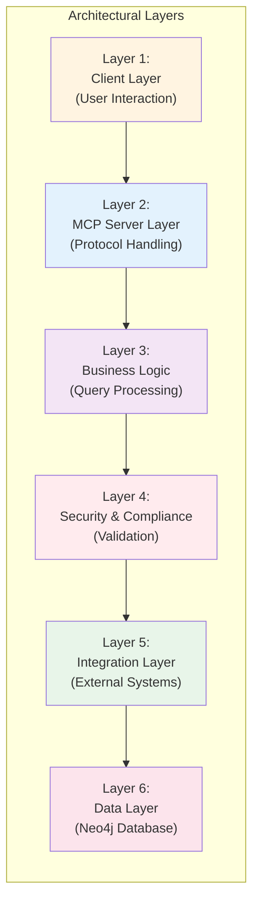

**Layer Descriptions:**

- **Layer 1 - Client Layer**: Claude Desktop, HTTP clients, custom MCP clients
- **Layer 2 - MCP Server Layer**: FastMCP protocol handling, tool/resource exposure
- **Layer 3 - Business Logic Layer**: GraphCypherQAChain, query orchestration
- **Layer 4 - Security & Compliance Layer**: Sanitization, audit logging, access control
- **Layer 5 - Integration Layer**: Multi-LLM abstraction, Neo4j driver, connection pooling
- **Layer 6 - Data Layer**: Neo4j 5.x, APOC/GDS plugins

---

## 3. System Context

### 3.1 System Boundary

```mermaid
graph TB
    subgraph External["External Systems"]
        OpenAI["OpenAI API"]
        Anthropic["Anthropic API"]
        Google["Google GenAI"]
    end

    subgraph SystemBoundary["Neo4j YASS MCP Server<br/>(System Boundary)"]
        Inputs["<b>Inputs:</b><br/>- Natural language queries<br/>- Configuration (env vars)<br/>- User authentication (future)"]
        Processing["<b>Processing:</b><br/>- NL to Cypher translation<br/>- Query sanitization<br/>- Audit logging"]
        Outputs["<b>Outputs:</b><br/>- Query results (JSON)<br/>- Schema information<br/>- Error messages (sanitized)<br/>- Audit logs"]
    end

    subgraph Database["Neo4j Database"]
        GraphDB["Graph Database<br/>(Customer-managed)<br/>On-prem/Cloud/AuraDB"]
    end

    External -.->|HTTPS/REST| Processing
    Inputs --> Processing --> Outputs
    Processing -->|Bolt (7687)| GraphDB

    style SystemBoundary fill:#e1f5ff,stroke:#01579b,stroke-width:3px
    style External fill:#fce4ec
    style Database fill:#e8f5e9
```

### 3.2 External Dependencies

```mermaid
graph LR
    subgraph System["Neo4j YASS MCP"]
        Core["MCP Server Core"]
    end

    LLM["LLM Provider<br/>(OpenAI/Anthropic/Google)<br/><b>Criticality:</b> High<br/><b>Fallback:</b> Switch provider"]
    Neo4j["Neo4j Database<br/>(Bolt Protocol)<br/><b>Criticality:</b> Critical<br/><b>Fallback:</b> None"]
    Client["MCP Client<br/>(stdio/HTTP/SSE)<br/><b>Criticality:</b> Critical<br/><b>Fallback:</b> None"]

    Client -->|MCP Protocol| Core
    Core -->|HTTPS/REST| LLM
    Core -->|Bolt (7687)| Neo4j

    style System fill:#e1f5ff
    style LLM fill:#fff3e0
    style Neo4j fill:#e8f5e9
    style Client fill:#f3e5f5
```

### 3.3 Integration Points

#### 3.3.1 MCP Client Integration

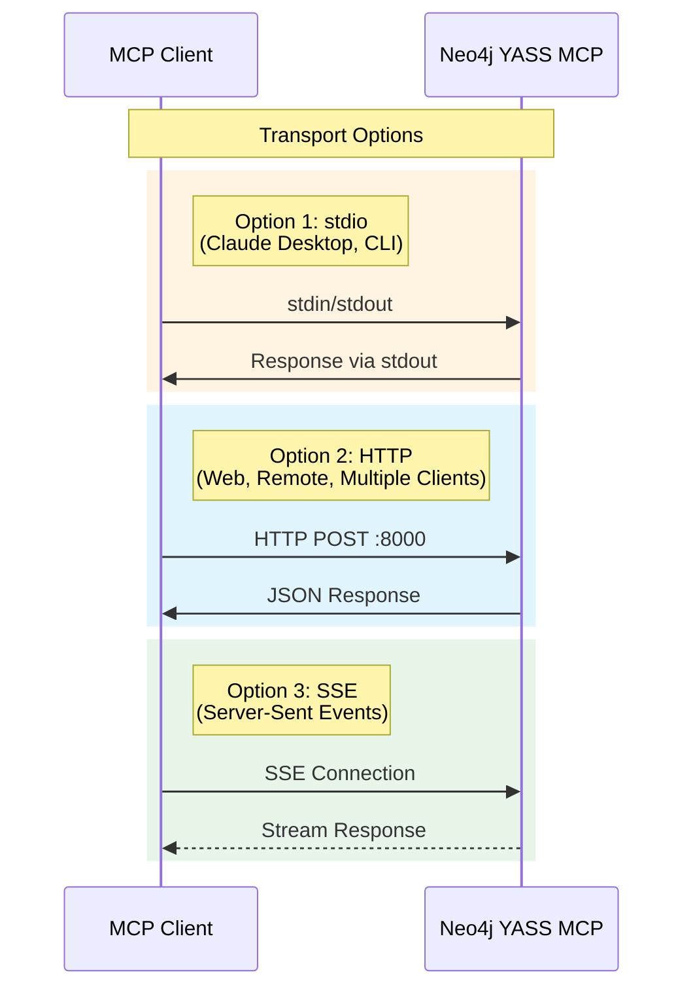

**MCP Tools Exposed:**

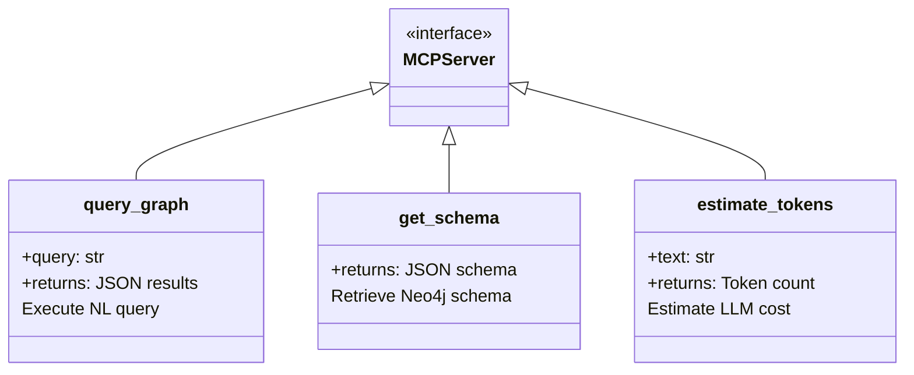

#### 3.3.2 LLM Provider Integration

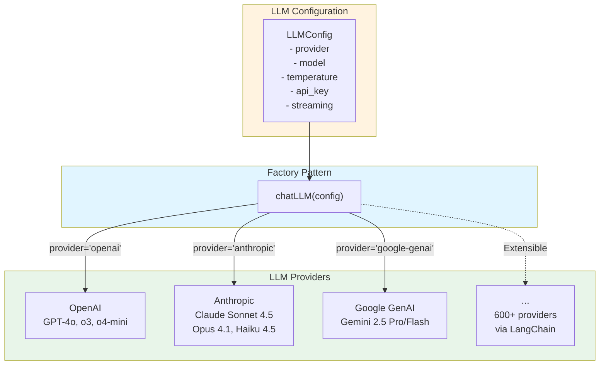

#### 3.3.3 Neo4j Integration

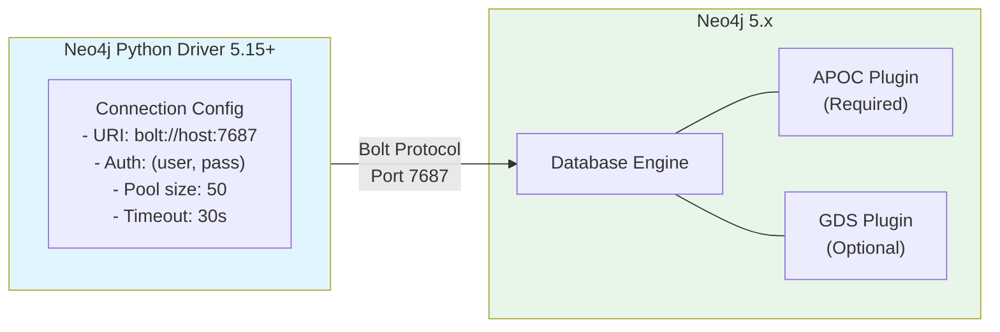

---

## 4. Component Architecture

### 4.1 Component Diagram

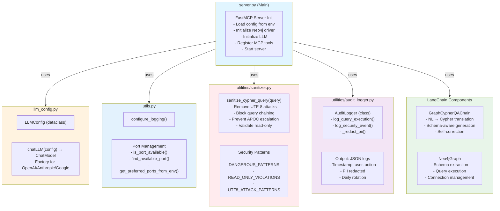

### 4.2 Query Processing Pipeline

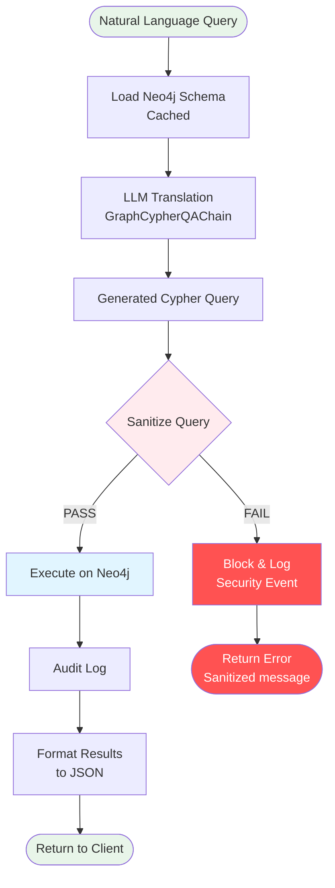

---

## 5. Data Flow

### 5.1 Query Execution Flow

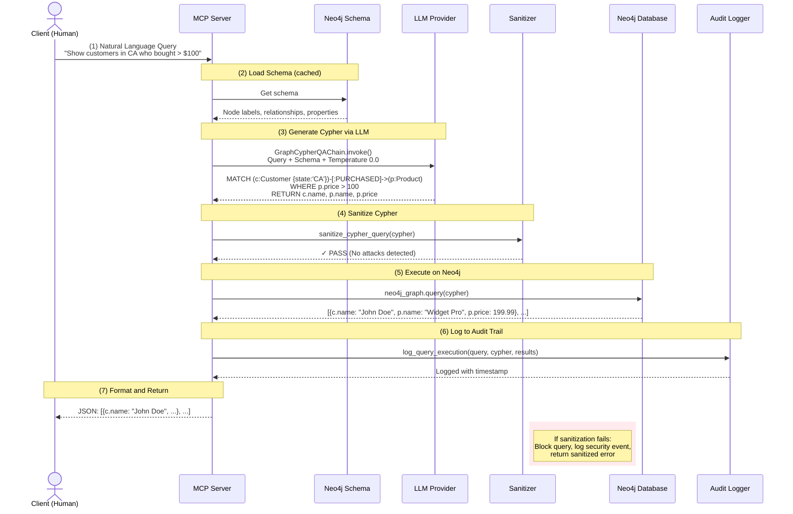

### 5.2 Error Handling Flow

```mermaid
sequenceDiagram
    actor User as Client
    participant MCP as MCP Server
    participant LLM as LLM Provider
    participant San as Sanitizer
    participant Audit as Audit Logger

    User->>MCP: Malicious Query<br/>"Show users; DROP TABLE users;"

    MCP->>LLM: Generate Cypher<br/>(may include semicolon)
    LLM-->>MCP: Generated Cypher with ';'

    MCP->>San: sanitize_cypher_query(cypher)

    rect rgb(255, 205, 210)
        San->>San: Detect query chaining (semicolon)
        San-->>MCP: ✗ BLOCKED: Query chaining detected
    end

    MCP->>Audit: log_security_event(<br/>"query_blocked",<br/>"Query chaining detected"<br/>)
    Audit-->>MCP: Event logged

    MCP-->>User: Error: "Query validation failed"<br/>(No technical details exposed)

    Note over User,MCP: Sanitized error message<br/>prevents information leakage
```

### 5.3 Schema Caching Flow

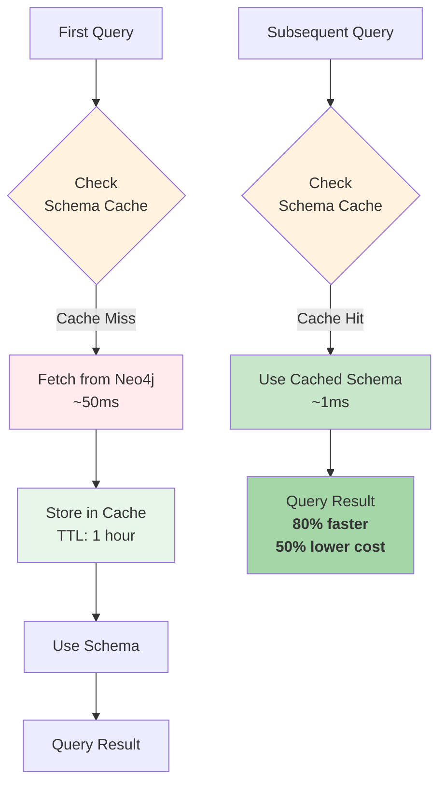

---

## 6. Security Architecture

### 6.1 Defense in Depth Strategy

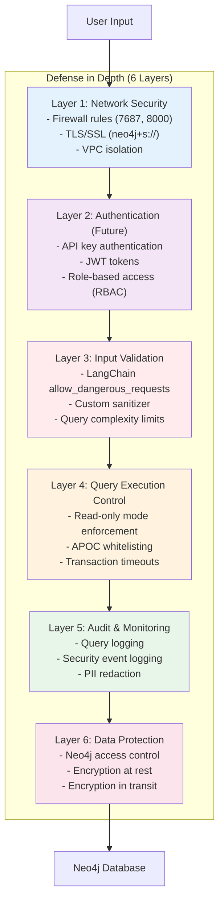

### 6.2 Threat Model

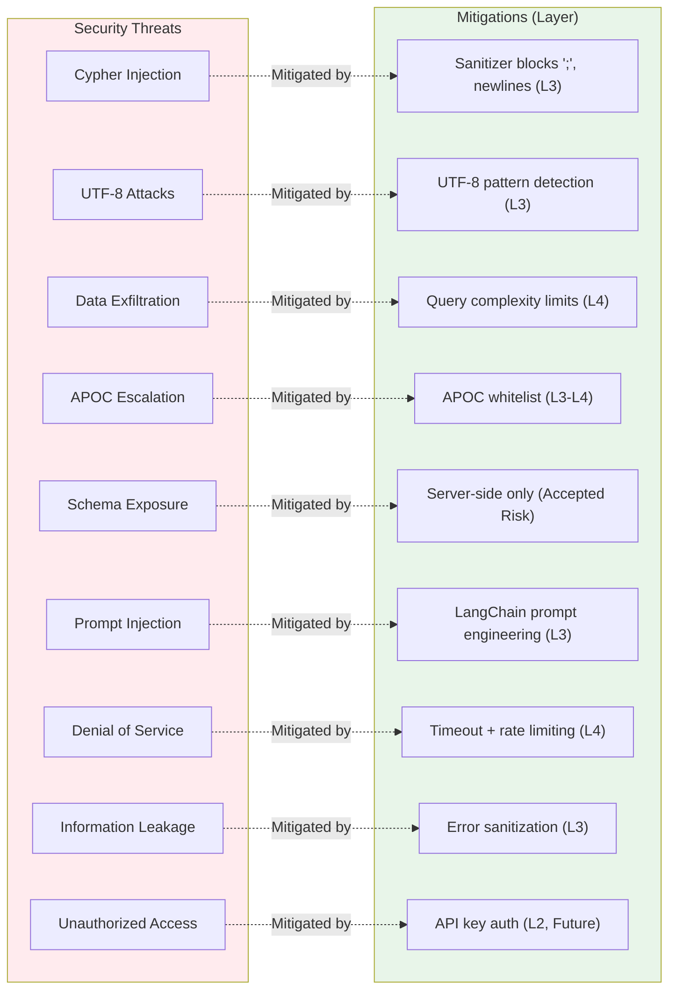

### 6.3 Compliance Architecture

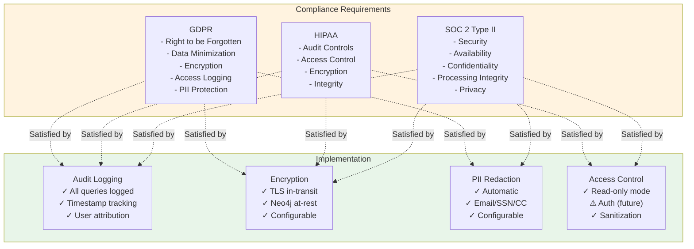

---

## 7. Deployment Architecture

### 7.1 Container Architecture (Docker)

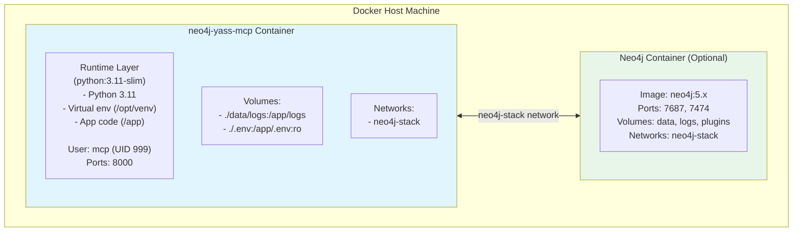

### 7.2 Multi-Stage Docker Build

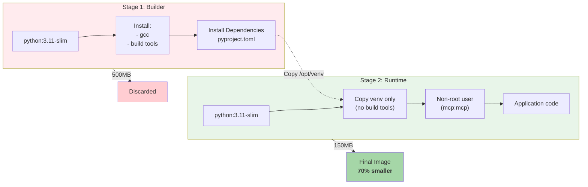

### 7.3 Deployment Topologies

#### 7.3.1 Single-Instance (Development)

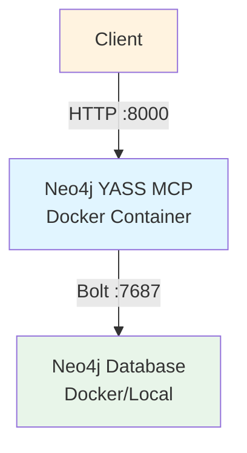

#### 7.3.2 Load-Balanced (Production)

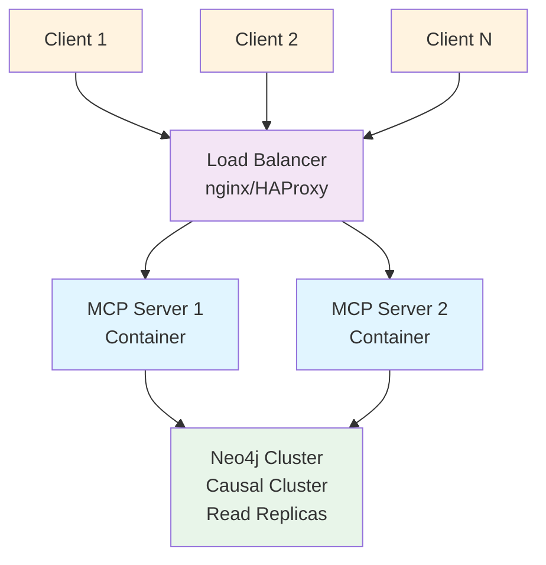

**Characteristics:**
- **Stateless MCP servers** (horizontal scaling)
- **Shared audit logs** (network volume)
- **Neo4j causal cluster** (read replicas)
- **Capacity**: 30 queries/s per server, linear scaling

#### 7.3.3 Multi-Tenant SaaS

```mermaid
graph TD
    CustomerA[Customer A]
    CustomerB[Customer B]
    CustomerC[Customer C]

    CustomerA --> Gateway
    CustomerB --> Gateway
    CustomerC --> Gateway

    Gateway[API Gateway / Router<br/>Tenant-based routing]

    Gateway --> MCPA[MCP Server A]
    Gateway --> MCPB[MCP Server B]
    Gateway --> MCPC[MCP Server C]

    MCPA --> DBA[Neo4j DB A]
    MCPB --> DBB[Neo4j DB B]
    MCPC --> DBC[Neo4j DB C]

    style CustomerA fill:#fff3e0
    style CustomerB fill:#fff3e0
    style CustomerC fill:#fff3e0
    style Gateway fill:#f3e5f5
    style MCPA fill:#e1f5ff
    style MCPB fill:#e1f5ff
    style MCPC fill:#e1f5ff
    style DBA fill:#e8f5e9
    style DBB fill:#e8f5e9
    style DBC fill:#e8f5e9
```

**Characteristics:**
- One MCP instance per tenant
- Separate Neo4j databases per tenant
- Centralized monitoring and logging

### 7.4 Network Architecture

```mermaid
graph TB
    subgraph External["External Network (Internet)"]
        OpenAI[OpenAI API]
        Anthropic[Anthropic API]
        Google[Google GenAI]
    end

    subgraph DMZ["DMZ / Public Subnet"]
        LB[Load Balancer<br/>nginx/ALB<br/>HTTPS :443, :8000]
    end

    subgraph AppSubnet["Application Subnet (Private)"]
        MCP1[MCP Server 1]
        MCP2[MCP Server 2]
        MCPN[MCP Server N]
    end

    subgraph DBSubnet["Database Subnet (Private)"]
        Neo4jCluster[Neo4j Database Cluster<br/>No internet access]
    end

    External -.->|HTTPS :443| DMZ
    DMZ -->|HTTP :8000| AppSubnet
    AppSubnet -->|Bolt :7687| DBSubnet
    AppSubnet -.->|HTTPS :443| External

    style External fill:#fce4ec
    style DMZ fill:#fff3e0
    style AppSubnet fill:#e1f5ff
    style DBSubnet fill:#e8f5e9
```

**Security Rules:**
- **DMZ**: Allow inbound 443 (HTTPS), 8000 (MCP)
- **App Subnet**: Allow inbound from DMZ only
- **DB Subnet**: Allow inbound from App Subnet only, **no internet access**

---

## 8. Technology Stack

### 8.1 Core Technologies

```mermaid
graph LR
    subgraph Stack["Technology Stack"]
        Runtime["Python 3.11+<br/>Application Runtime"]
        FastMCP["FastMCP 0.1.3+<br/>MCP Server"]
        LangChain["LangChain 0.3.7+<br/>NL to Cypher"]
        Neo4jDriver["neo4j-driver 5.15+<br/>Database Connectivity"]
        Neo4jDB["Neo4j 5.x<br/>Graph Database"]
        Docker["Docker 20.10+<br/>Containerization"]
        Compose["Docker Compose 2.0+<br/>Orchestration"]
    end

    Runtime --> FastMCP
    Runtime --> LangChain
    Runtime --> Neo4jDriver
    Neo4jDriver --> Neo4jDB
    Docker --> Runtime
    Compose --> Docker

    style Runtime fill:#e1f5ff
    style FastMCP fill:#f3e5f5
    style LangChain fill:#fff3e0
    style Neo4jDriver fill:#e8f5e9
    style Neo4jDB fill:#c8e6c9
    style Docker fill:#e3f2fd
    style Compose fill:#bbdefb
```

### 8.2 LLM Provider Libraries

```mermaid
graph TD
    subgraph Providers["LLM Provider Libraries"]
        OpenAILib["langchain-openai >= 0.2.8<br/>OpenAI (GPT-4o, o3, o4-mini)"]
        AnthropicLib["langchain-anthropic >= 0.3.0<br/>Anthropic (Claude Sonnet 4.5, etc.)"]
        GoogleLib["langchain-google-genai >= 2.0.3<br/>Google (Gemini 2.5 Pro/Flash)"]
        Extensible["600+ more providers<br/>via LangChain"]
    end

    Core["Neo4j YASS MCP Core"]

    Core --> OpenAILib
    Core --> AnthropicLib
    Core --> GoogleLib
    Core -.-> Extensible

    style Core fill:#e1f5ff
    style Providers fill:#e8f5e9
```

### 8.3 Dependency Tree

```mermaid
graph TB
    Root["neo4j-yass-mcp"]

    Root --> FastMCP["fastmcp >= 0.1.3"]
    FastMCP --> Pydantic["pydantic"]
    FastMCP --> Uvicorn["uvicorn (HTTP mode)"]

    Root --> LangChain["langchain >= 0.3.7"]
    LangChain --> LCCore["langchain-core"]
    LangChain --> LCComm["langchain-community"]
    LangChain --> LCText["langchain-text-splitters"]

    Root --> LCNeo4j["langchain-neo4j >= 0.2.0"]
    LCNeo4j --> Neo4jPy["neo4j >= 5.15.0"]

    Root --> LCOpenAI["langchain-openai >= 0.2.8"]
    LCOpenAI --> Tiktoken["tiktoken"]

    Root --> LCAnthropic["langchain-anthropic >= 0.3.0"]
    Root --> LCGoogle["langchain-google-genai >= 2.0.3"]
    Root --> DotEnv["python-dotenv >= 1.0.0"]

    style Root fill:#e1f5ff
    style FastMCP fill:#f3e5f5
    style LangChain fill:#fff3e0
    style LCNeo4j fill:#e8f5e9
```

---

## 9. Design Patterns

### 9.1 Architectural Patterns

#### 9.1.1 Layered Architecture

```mermaid
graph TD
    Presentation["Presentation Layer<br/>(MCP API)"]
    Business["Business Logic Layer<br/>(Query Processing)"]
    DataAccess["Data Access Layer<br/>(Neo4j Driver)"]
    Database["Database Layer<br/>(Neo4j)"]

    Presentation --> Business
    Business --> DataAccess
    DataAccess --> Database

    style Presentation fill:#e3f2fd
    style Business fill:#f3e5f5
    style DataAccess fill:#fff3e0
    style Database fill:#e8f5e9
```

**Benefits:**
- Clear separation of concerns
- Easy to test each layer independently
- Swappable components

#### 9.1.2 Pipe and Filter

```mermaid
graph LR
    NL[Natural Language] -->|Filter: Schema Injection| NLSchema[NL + Schema]
    NLSchema -->|Filter: LLM Translation| Cypher[Cypher Query]
    Cypher -->|Filter: Sanitization| SafeCypher[Safe Cypher]
    SafeCypher -->|Filter: Execution| RawResults[Raw Results]
    RawResults -->|Filter: Formatting| JSON[JSON Response]

    style NL fill:#fff3e0
    style Cypher fill:#e1f5ff
    style SafeCypher fill:#c8e6c9
    style JSON fill:#e8f5e9
```

### 9.2 Creational Patterns

#### 9.2.1 Factory Pattern

```mermaid
graph TD
    Config["LLMConfig<br/>provider, model, temperature, api_key"]

    Factory["chatLLM(config)<br/>Factory Function"]

    Config --> Factory

    Factory -->|provider='openai'| OpenAI["ChatOpenAI(...)"]
    Factory -->|provider='anthropic'| Anthropic["ChatAnthropic(...)"]
    Factory -->|provider='google-genai'| Google["ChatGoogleGenerativeAI(...)"]
    Factory -.->|Extensible| Others["Other Providers..."]

    style Config fill:#fff3e0
    style Factory fill:#e1f5ff
    style OpenAI fill:#e8f5e9
    style Anthropic fill:#e8f5e9
    style Google fill:#e8f5e9
```

### 9.3 Structural Patterns

#### 9.3.1 Adapter Pattern

```mermaid
graph TD
    OurCode["Our Code<br/>(Unified Interface)"]

    Adapter["LangChain<br/>(Adapter)"]

    OpenAI["OpenAI API"]
    Anthropic["Anthropic API"]
    Google["Google API"]

    OurCode --> Adapter
    Adapter --> OpenAI
    Adapter --> Anthropic
    Adapter --> Google

    style OurCode fill:#e1f5ff
    style Adapter fill:#fff3e0
    style OpenAI fill:#e8f5e9
    style Anthropic fill:#e8f5e9
    style Google fill:#e8f5e9
```

### 9.4 Behavioral Patterns

#### 9.4.1 Chain of Responsibility

```mermaid
graph LR
    Query[Query] --> UTF8[UTF-8 Attack<br/>Check]
    UTF8 -->|Pass| Chaining[Query Chaining<br/>Check]
    Chaining -->|Pass| APOC[APOC Escalation<br/>Check]
    APOC -->|Pass| ReadOnly[Read-Only<br/>Check]
    ReadOnly -->|Pass| Safe[Safe Query]

    UTF8 -.->|Block| Error[Error]
    Chaining -.->|Block| Error
    APOC -.->|Block| Error
    ReadOnly -.->|Block| Error

    style Query fill:#fff3e0
    style Safe fill:#c8e6c9
    style Error fill:#ffcdd2
```

#### 9.4.2 Strategy Pattern

```mermaid
classDiagram
    class LLMStrategy {
        <<interface>>
        +generate_cypher(query, schema) str
    }

    class OpenAIStrategy {
        +generate_cypher(query, schema) str
    }

    class AnthropicStrategy {
        +generate_cypher(query, schema) str
    }

    class GoogleStrategy {
        +generate_cypher(query, schema) str
    }

    LLMStrategy <|-- OpenAIStrategy
    LLMStrategy <|-- AnthropicStrategy
    LLMStrategy <|-- GoogleStrategy

    class Context {
        -strategy: LLMStrategy
        +set_strategy(strategy)
        +execute_query(query)
    }

    Context --> LLMStrategy
```

---

## 10. Scalability & Performance

### 10.1 Performance Characteristics

```mermaid
graph LR
    subgraph Operations["Operations & Performance"]
        Schema["Schema Retrieval<br/>Latency: 50ms (uncached)<br/>1ms (cached)<br/>Throughput: 1000 req/s"]

        QueryGen["Query Generation<br/>Latency: 1-3s<br/>Throughput: 10-30 req/s<br/>Bottleneck: LLM API"]

        QueryExec["Query Execution<br/>Latency: 100-500ms<br/>Throughput: 50-200 req/s<br/>Bottleneck: Neo4j complexity"]

        E2E["End-to-End<br/>Latency: 1.5-4s<br/>Throughput: 10-30 req/s<br/>Bottleneck: LLM API"]
    end

    style Schema fill:#c8e6c9
    style QueryGen fill:#fff3e0
    style QueryExec fill:#e1f5ff
    style E2E fill:#f3e5f5
```

### 10.2 Horizontal Scaling

```mermaid
graph TB
    LB[Load Balancer]

    LB --> S1[MCP Server 1<br/>30 queries/s]
    LB --> S2[MCP Server 2<br/>30 queries/s]
    LB --> S3[MCP Server 3<br/>30 queries/s]
    LB --> SN[MCP Server N<br/>30 queries/s]

    S1 --> Cluster
    S2 --> Cluster
    S3 --> Cluster
    SN --> Cluster

    Cluster[Neo4j Cluster<br/>Read Replicas]

    Capacity["Total Capacity:<br/>N servers × 30 req/s<br/><b>Linear Scaling</b><br/>(Stateless Design)"]

    style LB fill:#f3e5f5
    style S1 fill:#e1f5ff
    style S2 fill:#e1f5ff
    style S3 fill:#e1f5ff
    style SN fill:#e1f5ff
    style Cluster fill:#e8f5e9
    style Capacity fill:#fff3e0
```

### 10.3 Caching Strategy

```mermaid
graph TB
    subgraph Caching["Caching Layers"]
        SchemaCache["Schema Cache<br/>(In-memory)<br/>TTL: 1 hour<br/><b>Impact:</b> 80% latency reduction"]

        ResultCache["Query Result Cache<br/>(Future: Redis)<br/>TTL: 5 minutes<br/><b>Impact:</b> 70% cost reduction"]

        ConnectionPool["Connection Pool<br/>(Neo4j Driver)<br/>Pool size: 50<br/><b>Impact:</b> No handshake overhead"]
    end

    style SchemaCache fill:#c8e6c9
    style ResultCache fill:#e1f5ff
    style ConnectionPool fill:#fff3e0
```

### 10.4 Monitoring & Observability

```mermaid
graph TD
    subgraph Metrics["Key Metrics to Track"]
        Latency["Query Latency<br/>Alert: >5s (p95)"]
        ErrorRate["Error Rate<br/>Alert: >5%"]
        LLMLatency["LLM API Latency<br/>Alert: >10s"]
        ConnPool["Connection Pool<br/>Alert: >80% usage"]
        Security["Sanitization Blocks<br/>Alert: >10/hour"]
        AuditSize["Audit Log Size<br/>Alert: >1GB/day"]
    end

    Monitor[Monitoring System] --> Latency
    Monitor --> ErrorRate
    Monitor --> LLMLatency
    Monitor --> ConnPool
    Monitor --> Security
    Monitor --> AuditSize

    style Monitor fill:#e1f5ff
    style Latency fill:#fff3e0
    style ErrorRate fill:#ffebee
    style LLMLatency fill:#f3e5f5
    style ConnPool fill:#e8f5e9
    style Security fill:#ffcdd2
    style AuditSize fill:#c8e6c9
```

---

## 11. Future Architecture Evolution

### 11.1 Conversational Query Refinement (Q1 2026)

```mermaid
sequenceDiagram
    actor User
    participant CM as Conversation Manager<br/>(New Component)
    participant MCP as MCP Server
    participant LLM as LLM Provider
    participant Neo4j

    User->>MCP: "Show me customers"
    MCP->>CM: Load session context
    CM-->>MCP: New session created

    MCP->>LLM: Generate query with history
    LLM-->>MCP: Generated Cypher
    MCP->>Neo4j: Execute
    Neo4j-->>MCP: 10,000 results

    MCP->>CM: Analyze results, suggest refinements
    CM-->>User: "Found 10,000 customers. Filter by:<br/>1. Location?<br/>2. Purchase history?<br/>3. Registration date?"

    User->>MCP: "Last 30 days, in California"
    MCP->>CM: Load previous context
    CM-->>MCP: Previous query + new refinement

    MCP->>LLM: Generate refined query
    LLM-->>MCP: Refined Cypher
    MCP->>Neo4j: Execute
    Neo4j-->>MCP: 47 results

    MCP->>CM: Update session state
    MCP-->>User: 47 customers (refined results)

    rect rgb(255, 243, 224)
        Note over CM: ConversationContext:<br/>- session_id<br/>- query_history<br/>- cypher_history<br/>- schema_context<br/>- user_preferences
    end
```

**Architectural Impact:**
- Add stateful session layer (breaks stateless design)
- **Mitigation**: Use Redis for shared session storage
- **Performance**: Minimal (<10ms session lookup)

### 11.2 Multi-Database Support (Q2 2026)

```mermaid
graph TB
    User[User Query:<br/>"Show customer orders for product XYZ"]

    MCP[MCP Server]

    subgraph NewComponents["New Components"]
        Router[Database Router<br/>LLM analyzes query intent]
        Federator[Query Federator<br/>Cross-DB join orchestration]
    end

    User --> MCP
    MCP --> Router

    Router -->|Entities: customers, products| Decision{Single or<br/>Multiple DBs?}

    Decision -->|Single DB| DB1Direct[Execute on DB1]
    Decision -->|Multiple DBs| Federator

    Federator --> DB1[Neo4j DB1<br/>Customer Data]
    Federator --> DB2[Neo4j DB2<br/>Product Catalog]

    DB1 --> Join[Join Results]
    DB2 --> Join

    Join --> Response[Unified Response]

    style NewComponents fill:#fff3e0
    style Router fill:#e1f5ff
    style Federator fill:#f3e5f5
    style DB1 fill:#e8f5e9
    style DB2 fill:#e8f5e9
```

**Configuration:**

```mermaid
classDiagram
    class DatabaseConfig {
        +str name
        +str uri
        +str database
        +tuple credentials
        +dict schema_cache
    }

    class DatabaseRouter {
        +determine_target_databases(query, databases) List~str~
    }

    class QueryFederator {
        +execute_federated_query(query, target_dbs) Dict
    }

    DatabaseRouter --> DatabaseConfig
    QueryFederator --> DatabaseConfig
```

**Architectural Impact:**
- Add database routing layer
- **Performance**: +100-200ms for DB selection
- **Complexity**: Manual cross-database joins

### 11.3 GraphQL Federation (Q3 2026)

```mermaid
graph TB
    Client[Client]

    subgraph MCPServer["Neo4j YASS MCP Server"]
        Mode{Mode Selection}

        subgraph MCPMode["MCP Mode (Current)"]
            FastMCP[FastMCP Server<br/>MCP Tools API]
        end

        subgraph GraphQLMode["GraphQL Mode (New)"]
            GQLServer[GraphQL Server<br/>Port 4000]
            AutoSchema[Auto-generate schema<br/>from Neo4j]
            DualInterface[Dual Interface:<br/>1. Traditional GraphQL<br/>2. NL resolver]
        end
    end

    LLM[LLM Provider]
    Neo4j[Neo4j Database]

    Client -->|MCP Protocol| Mode
    Mode --> MCPMode
    Mode --> GraphQLMode

    FastMCP --> LLM
    FastMCP --> Neo4j

    GQLServer --> AutoSchema
    AutoSchema --> Neo4j
    DualInterface --> LLM
    DualInterface --> Neo4j

    style MCPMode fill:#e1f5ff
    style GraphQLMode fill:#e8f5e9
```

**Dual Interface Example:**

```mermaid
graph LR
    subgraph Developers["For Developers"]
        Traditional["Traditional GraphQL<br/>query {<br/>  customer(id: '123') {<br/>    name<br/>    orders { total }<br/>  }<br/>}"]
    end

    subgraph Everyone["For Everyone"]
        NaturalLang["Natural Language<br/>query {<br/>  queryGraph(<br/>    question: 'Show customer 123 orders'<br/>  )<br/>}"]
    end

    Traditional --> SameData[Same Data]
    NaturalLang --> SameData

    style Developers fill:#e1f5ff
    style Everyone fill:#e8f5e9
    style SameData fill:#c8e6c9
```

### 11.4 Migration Path

```mermaid
graph LR
    V1["Version 1.0<br/>(Current)<br/><br/>- MCP server<br/>- Single database<br/>- Single-turn queries"]

    V2["Version 2.0<br/>(Q1 2026)<br/><br/>- MCP server<br/>- Single database<br/>- Multi-turn queries<br/>(+session_id param)"]

    V3["Version 3.0<br/>(Q2 2026)<br/><br/>- MCP server<br/>- Multi-database<br/>(+database param)<br/>- Multi-turn queries"]

    V4["Version 4.0<br/>(Q3 2026)<br/><br/>- MCP server (mode=mcp)<br/>- GraphQL (mode=graphql)<br/>- Multi-database<br/>- Multi-turn queries"]

    V1 -->|Backward<br/>Compatible| V2
    V2 -->|Backward<br/>Compatible| V3
    V3 -->|Parallel<br/>Modes| V4

    style V1 fill:#e3f2fd
    style V2 fill:#e1f5ff
    style V3 fill:#bbdefb
    style V4 fill:#90caf9
```

**Backward Compatibility Strategy:**
- Optional parameters (default to v1.0 behavior)
- Feature flags (environment variables)
- Deprecation warnings (12-month notice)

---

## 12. Appendices

### Appendix A: Configuration Reference

See [.env.example](../.env.example) for complete configuration options.

**Critical Settings:**

```bash
# Neo4j Connection
NEO4J_URI=bolt://localhost:7687
NEO4J_PASSWORD=strong-password

# LLM Provider
LLM_PROVIDER=anthropic
LLM_MODEL=claude-sonnet-4-5
LLM_API_KEY=sk-ant-...
LLM_TEMPERATURE=0.0
LLM_STREAMING=false

# Security
ALLOW_WEAK_PASSWORDS=false
LANGCHAIN_ALLOW_DANGEROUS_REQUESTS=false
DEBUG_MODE=false
SANITIZER_ENABLED=true
READ_ONLY_MODE=false

# Audit Logging
AUDIT_ENABLED=true
AUDIT_LOG_DIR=./data/logs/audit
AUDIT_PII_REDACTION=true

# MCP Transport
MCP_TRANSPORT=http
MCP_SERVER_HOST=0.0.0.0
MCP_SERVER_PORT=8000
```

### Appendix B: API Reference

**MCP Tools:**

```python
@mcp_server.tool()
async def query_graph(query: str) -> str:
    """
    Execute natural language query against Neo4j graph database.

    Args:
        query: Natural language question about the graph

    Returns:
        JSON string containing query results

    Raises:
        ValueError: If query fails sanitization
        RuntimeError: If Neo4j query fails
    """

@mcp_server.tool()
async def get_schema() -> str:
    """
    Retrieve Neo4j graph schema.

    Returns:
        JSON string with:
        - node_labels: List of node types
        - relationship_types: List of relationship types
        - properties: Dict of properties per label
    """

@mcp_server.tool()
async def estimate_tokens(text: str) -> str:
    """
    Estimate LLM token count for cost planning.

    Args:
        text: Text to tokenize

    Returns:
        JSON string with token count and estimated cost
    """
```

### Appendix C: Security Checklist

```mermaid
graph TD
    Start([Production Deployment]) --> Check1{Strong Neo4j<br/>Password?}

    Check1 -->|No| Fix1[Set 20+ char password<br/>Mixed case, special chars]
    Check1 -->|Yes| Check2{TLS Enabled<br/>for Neo4j?}

    Fix1 --> Check2

    Check2 -->|No| Fix2[Use neo4j+s:// URI]
    Check2 -->|Yes| Check3{Weak Passwords<br/>Disabled?}

    Fix2 --> Check3

    Check3 -->|No| Fix3[ALLOW_WEAK_PASSWORDS=false]
    Check3 -->|Yes| Check4{Debug Mode<br/>Disabled?}

    Fix3 --> Check4

    Check4 -->|No| Fix4[DEBUG_MODE=false]
    Check4 -->|Yes| Check5{Audit Logging<br/>Enabled?}

    Fix4 --> Check5

    Check5 -->|No| Fix5[AUDIT_ENABLED=true<br/>AUDIT_PII_REDACTION=true]
    Check5 -->|Yes| Check6{Firewall<br/>Configured?}

    Fix5 --> Check6

    Check6 -->|No| Fix6[Configure ports 7687, 8000]
    Check6 -->|Yes| Ready([Production Ready!])

    Fix6 --> Ready

    style Start fill:#e3f2fd
    style Ready fill:#c8e6c9
    style Check1 fill:#fff3e0
    style Check2 fill:#fff3e0
    style Check3 fill:#fff3e0
    style Check4 fill:#fff3e0
    style Check5 fill:#fff3e0
    style Check6 fill:#fff3e0
    style Fix1 fill:#ffebee
    style Fix2 fill:#ffebee
    style Fix3 fill:#ffebee
    style Fix4 fill:#ffebee
    style Fix5 fill:#ffebee
    style Fix6 fill:#ffebee
```

### Appendix D: Troubleshooting Guide

```mermaid
graph TD
    Issue[Common Issue]

    Issue --> I1{Cannot connect<br/>to Neo4j}
    Issue --> I2{Weak password<br/>detected}
    Issue --> I3{LLM API<br/>error}
    Issue --> I4{Query<br/>blocked}
    Issue --> I5{High<br/>latency}

    I1 --> S1[Solution:<br/>- Check NEO4J_URI<br/>- Verify password<br/>- Ensure Neo4j running]

    I2 --> S2[Solution:<br/>- Set strong password<br/>- Or ALLOW_WEAK_PASSWORDS=true<br/>(dev only)]

    I3 --> S3[Solution:<br/>- Verify API key format<br/>sk- for OpenAI<br/>sk-ant- for Anthropic]

    I4 --> S4[Solution:<br/>- Check audit logs<br/>- Review sanitization failure<br/>- Adjust query]

    I5 --> S5[Solution:<br/>- Check LLM provider status<br/>- Verify Neo4j indexes<br/>- Check network latency]

    style Issue fill:#e3f2fd
    style I1 fill:#fff3e0
    style I2 fill:#fff3e0
    style I3 fill:#fff3e0
    style I4 fill:#fff3e0
    style I5 fill:#fff3e0
    style S1 fill:#e8f5e9
    style S2 fill:#e8f5e9
    style S3 fill:#e8f5e9
    style S4 fill:#e8f5e9
    style S5 fill:#e8f5e9
```

### Appendix E: Performance Tuning

```mermaid
graph TB
    subgraph Neo4j["Neo4j Optimization"]
        N1[Create indexes on<br/>frequently queried properties]
        N2[Enable APOC plugin]
        N3[Tune heap size<br/>4GB min, 16GB+ recommended]
        N4[Use SSD storage<br/>10x faster than HDD]
    end

    subgraph MCP["MCP Server Optimization"]
        M1[Enable schema caching<br/>(automatic)]
        M2[Use HTTP transport<br/>(better concurrency)]
        M3[Increase connection pool<br/>for high load]
        M4[Monitor thread pool<br/>utilization]
    end

    subgraph LLM["LLM Provider Optimization"]
        L1[Use temperature=0.0<br/>(deterministic)]
        L2[Enable streaming<br/>LLM_STREAMING=true]
        L3[Choose cost-effective models<br/>Gemini 2.5 Flash, GPT-4o-mini]
        L4[Monitor API usage<br/>and costs]
    end

    Perf[Performance Tuning] --> Neo4j
    Perf --> MCP
    Perf --> LLM

    style Perf fill:#e1f5ff
    style Neo4j fill:#e8f5e9
    style MCP fill:#fff3e0
    style LLM fill:#f3e5f5
```

### Appendix F: Related Documents

```mermaid
graph TB
    SAD[Software Architecture<br/>Document SAD]

    SAD --> README[README.md<br/>Project overview]
    SAD --> QS[QUICK_START.md<br/>5-minute setup]
    SAD --> Docker[DOCKER.md<br/>Deployment guide]
    SAD --> Security[SECURITY.md<br/>Security practices]
    SAD --> Business[BUSINESS_CASE.md<br/>ROI & value]
    SAD --> Providers[LLM_PROVIDERS.md<br/>LLM configuration]
    SAD --> Adding[ADDING_LLM_PROVIDERS.md<br/>Add new providers]

    style SAD fill:#e1f5ff
    style README fill:#e8f5e9
    style QS fill:#fff3e0
    style Docker fill:#f3e5f5
    style Security fill:#ffebee
    style Business fill:#c8e6c9
    style Providers fill:#e3f2fd
    style Adding fill:#bbdefb
```

---

**Document Metadata:**
- **Version**: 1.0
- **Last Updated**: November 2025
- **Maintained By**: Neo4j YASS MCP Team
- **Review Cycle**: Quarterly or after major architecture changes

---

*This document describes the production architecture as of v1.0 with Mermaid diagrams for better visualization. For future architecture evolution, see Section 11.*
