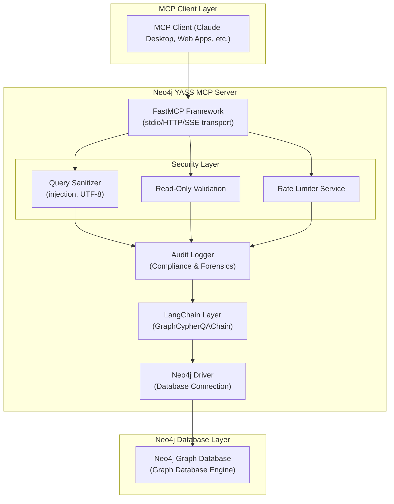
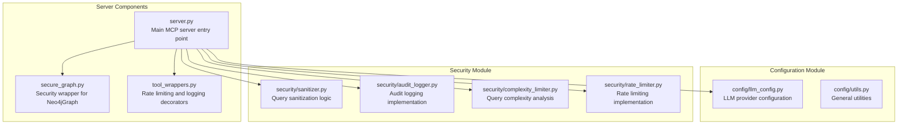
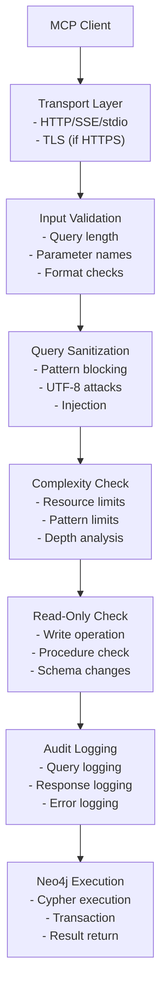
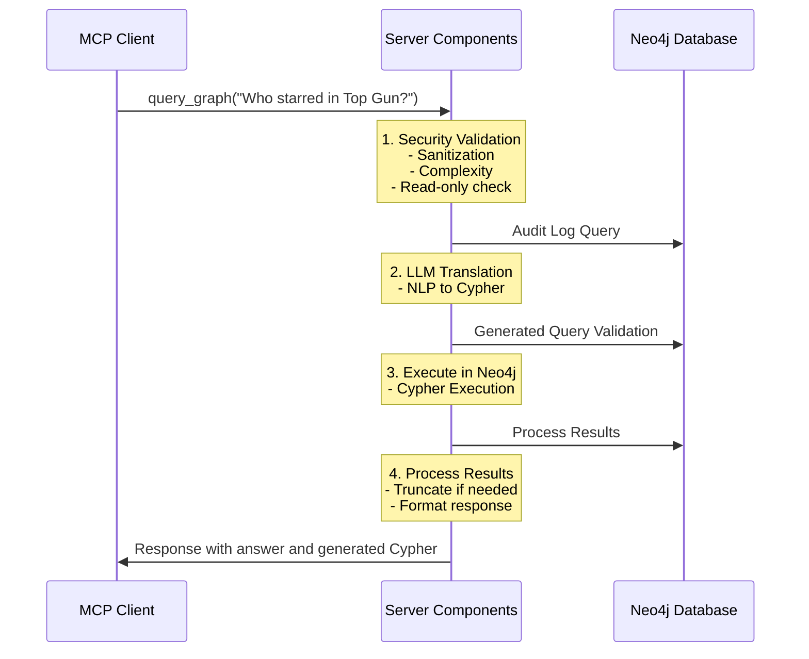
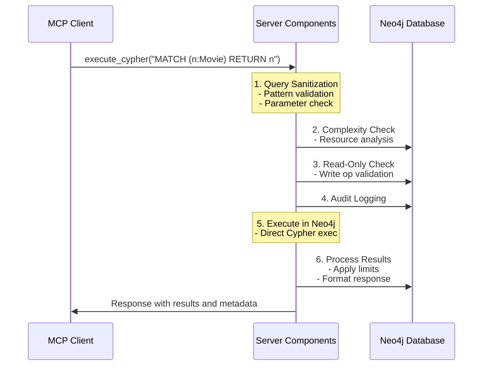
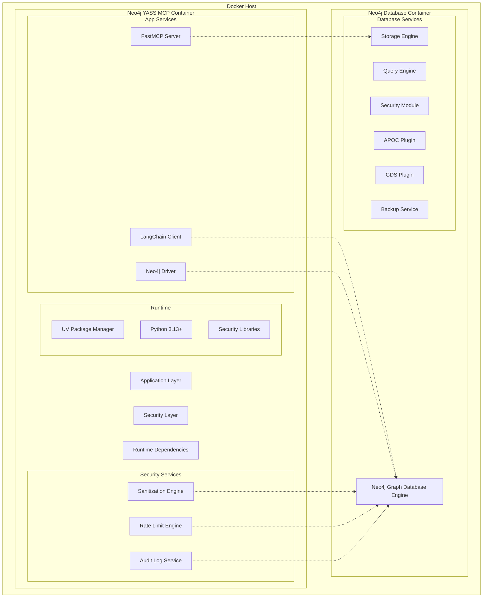
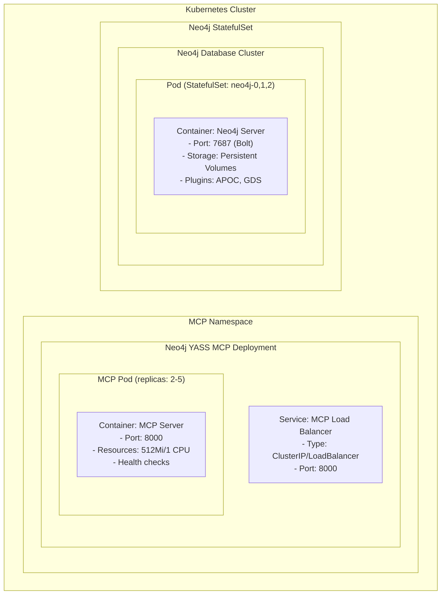
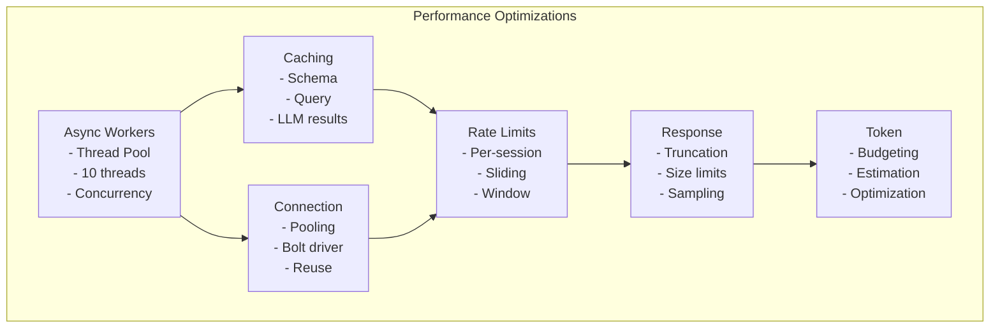
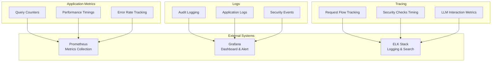
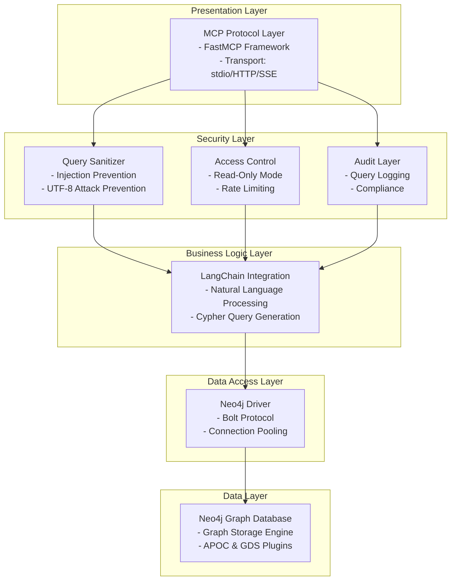

# Mermaid Architecture Diagrams: Neo4j YASS MCP

## High-Level Architecture

## Component Architecture

## Security Architecture (Defense-in-Depth)

## Natural Language Query Flow

## Raw Cypher Query Flow

## Deployment Architecture

## Kubernetes Deployment Architecture

## Performance & Scalability Architecture

## Observability Architecture

## Layered Architecture

